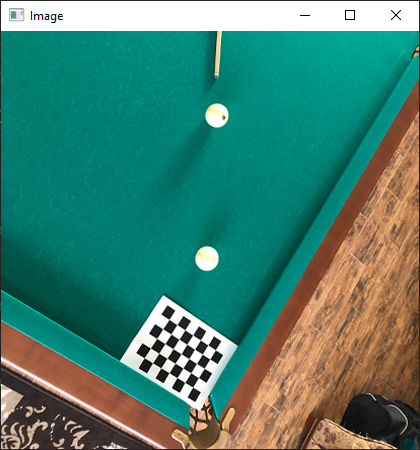

# cv-lab-2
Computer Vision Lab: color space, distance map

## Task

1. Read image from file

2. Make transformation image to YUV

3. Enhance Contrast

4. Find edges of objects

5. Find the corner points in the image. Draw them around
with radius r (r=2) on the same image where there are edges.

6. For the boundaries and corner points found, a map is built
distances D[i,j] by the distance transformation method.

7. In each pixel [i, j] filtering is performed by averaging.
The filter size for averaging depends on reaching up to
corner and edge points and equal
k*D[i,j], where k is an algorithm parameter. So than
further away from an edge or corner, the greater the averaging (more
noise reduction).

8. To speed up calculations when averaging, you need
use integrated images.

9. Make the reverse transformation YUV->BGR. Display BGR.

## Source image

